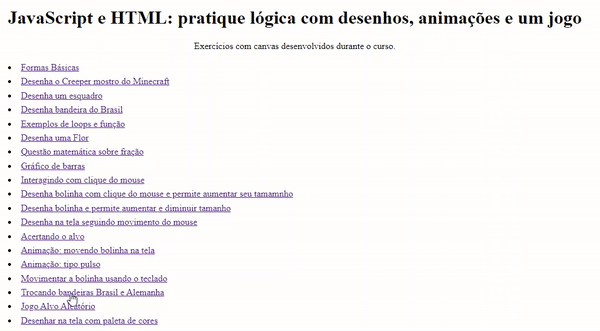
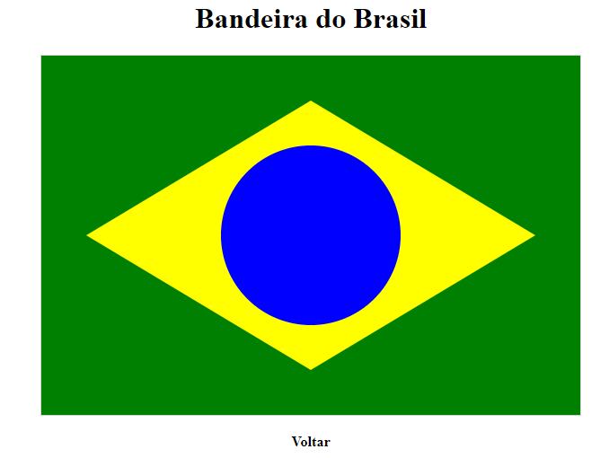

# Curso de Canvas
Exercícios desenvolvidos durante o curso "JavaScript e HTML: pratique lógica com desenhos, animações e um jogo" da Alura.

O objetivo do curso é praticar os seguintes conceitos:
 - Desenhar gráficos com Canvas
 - Funções da Canvas API
 - Interagir com usuário através do mouse e teclado
 - Mover elementos com animações simples
   
## 💻 Layout   

  
  
  

## 🔧 Tecnologias
As tecnologias usadas foram:
- HTML
- JavaScript
